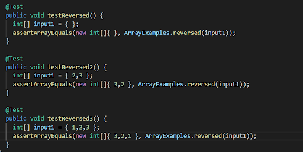

# Part 1

# Part 2

## Bug 1: reverseInPlace

* The failure-inducing input:

* The symptom:

* The bug:

* The code after the bug was fixed:

## Bug 2: reverseInPlace
* The failure-inducing input:
* The symptom:
* The bug:
* The code after the bug was fixed:
