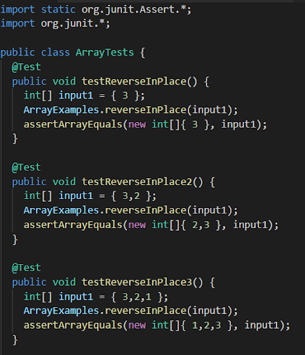
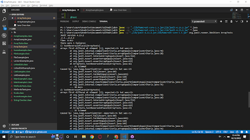
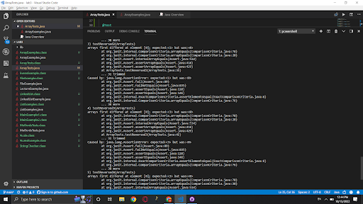
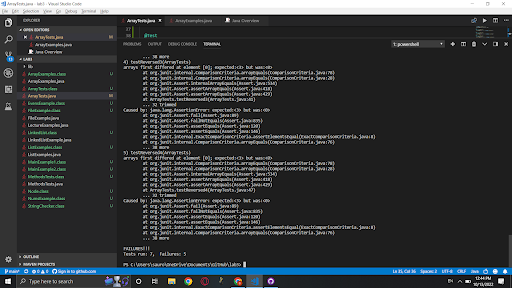
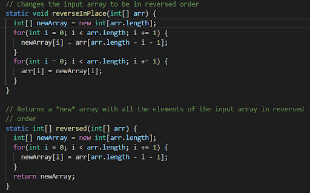

# Part 1

* Code for SearchEngine.java:

```
import java.io.IOException;
import java.net.URI;
import java.util.ArrayList;

class Handler implements URLHandler {
    // The one bit of state on the server: a number that will be manipulated by
    // various requests.
    ArrayList<String> strings = new ArrayList<String>();

    public String handleRequest(URI url) {
        if (url.getPath().equals("/")) {
            return String.format("Welcome to Ben's Server");
        } else if (url.getPath().equals("/search")) {
            String[] parameters = url.getQuery().split("=");
                if (parameters[0].equals("s")) {
                    ArrayList<String> substrings = new ArrayList<String>();
                    for (String str:strings){
                        if (str.contains(parameters[1].toString())){
                            substrings.add(str);
                        }  
                    }
                    return substrings.toString();
                }
        } else if (url.getPath().equals("/add")) {
            String[] parameters = url.getQuery().split("=");
                if (parameters[0].equals("s")) {
                    strings.add(parameters[1].toString());
                    return String.format("Strings increased by 1!");
                }
        } else {
            return "404 Not Found!";
        }
        return null;
    }
}

class SearchEngine {
    public static void main(String[] args) throws IOException {
        if(args.length == 0){
            System.out.println("Missing port number! Try any number between 1024 to 49151");
            return;
        }

        int port = Integer.parseInt(args[0]);

        Server.start(port, new Handler());
    }
}
```

* Root directory: When I run the command java NumberServer 3211 and visit localhost:3211, the class SearchEngine starts the server using my port number of 3211 and creates a new Handler instance. In the Handler class, the handleRequest method is called and recognizes that url.getPath().equals("/") is true. It will then return the string "Welcome to Ben's Server". 
  


* Add: When I run the command java NumberServer 3211 and visit localhost:3211/add?s=anewstringtoadd, the class SearchEngine starts the server using my port number of 3211 and creates a new Handler instance. In the Handler class, the handleRequest method is called and recognizes that url.getPath().equals("/add") is true. It will create a string array called parameters that equals the query split at the '=', so its value is now ["s", "anewstringtoadd"]. The "anewstringtoadd" string is added to an arraylist called strings instantiated at the beginning of the Handler class. 


* Query: When I run the command java NumberServer 3211 and visit localhost:3211/add?s=apple, localhost:3211/add?s=pineapple, localhost:3211/add?s=pineapple, and localhost:3211/search?s=app, the class SearchEngine starts the server using my port number of 3211 and creates a new Handler instance. In the Handler class, the handleRequest method is called and recognizes that url.getPath().equals("/search") is true. It will create a string array called parameters that equals the query split at the '=', so its value is now ["s", "app"]. It creates an arraylist called substrings, parses the arraylist called "strings" instantiated at the beginning of the Handler class, and adds any strings from arraylist "strings" which contain the substring "app". The arraylist substrings is then returned.


# Part 2

## Bug 1: reverseInPlace in ArrayExamples.java

* The failure-inducing input:



* The symptom:





* The bug:


* The code after the bug was fixed:



* Connection between the symptom and the bug:

The bug occurs because the function overwrites the index value while replacing it with an index value from the opposite end of the array. Since the index value is overriden without being stored elsewhere first, the function will return a palindromic array that is incorrect. However as shown in my tests, input arrays with lengths of 1 are unaffected since their sole index will not be overriden.

## Bug 2: filter in ListExamples.java

* The failure-inducing input:


* The symptom:


* The bug:


* The code after the bug was fixed:


* Connection between the symptom and the bug:

The bug occurs because the function always adds the string to the first index of the list. When new elements are added to the list, older elements are pushed back by an index, so the list will be in reverse order from the order in which elements are added. As shown, input lists with one element are unaffected by the bug because there are no other elements to push back an index.
